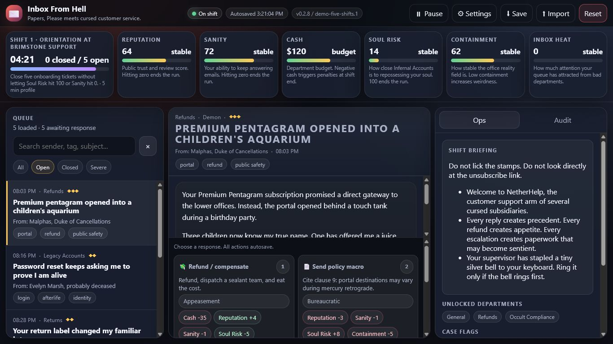
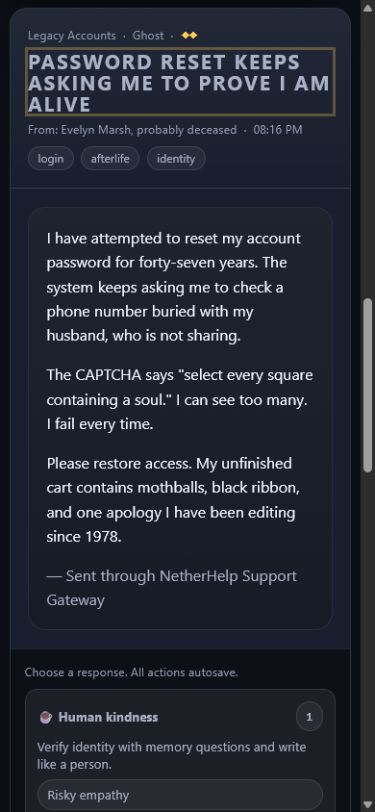
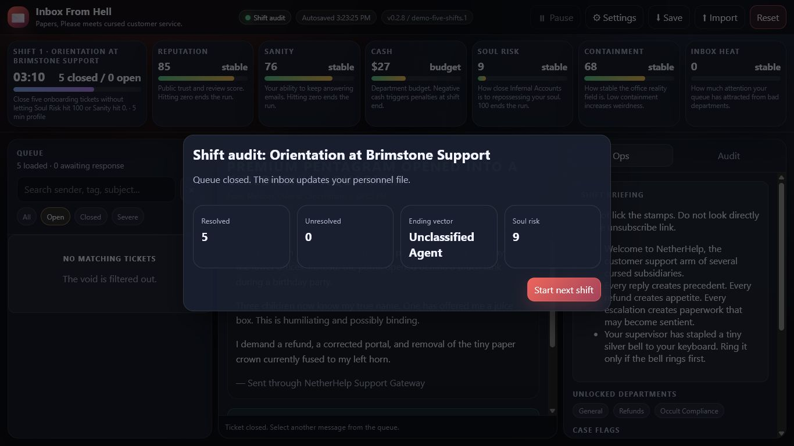

# Inbox From Hell

> A decision-driven browser game where every customer-support reply changes the agent's reputation, sanity, cash, containment, inbox pressure, and soul risk.

[Play the live demo](https://inbox-from-hell-demo.netlify.app/)

Designed and developed by **Jerry R. Napier**.


## Overview

**Inbox From Hell** turns a familiar support queue into a five-shift workplace-horror simulation. Players resolve 29 authored tickets, balance six competing metrics, unlock new departments, and carry earlier decisions into later shifts.

Behind the playful premise is a practical systems-design exercise: model branching decisions clearly, preserve progress safely, and keep a dense interface usable across desktop and mobile. The same architecture could support training or policy simulations where decisions create measurable downstream tradeoffs.

## Highlights

- Data-driven tickets and outcomes keep narrative content separate from game rules, making the experience easier to extend and tune.
- Centralized action definitions and bounded metrics keep consequences consistent across all five shifts.
- Schema-aware local saves protect corrupt, incompatible, and conflicting progress instead of silently overwriting it.
- Responsive controls, reduced-motion support, adjustable text scale, keyboard shortcuts, focus management, and semantic dialogs improve access across devices.
- A client-only architecture keeps gameplay private and removes server cost, account management, and runtime dependency risk.
- Automated CI completes a full playthrough and validates every ticket, save recovery, source syntax, security configuration, and repository scope on Node 20 and 22.

## Screens

### Support queue



### Mobile decision flow



### Shift audit



## Run locally

No package installation or build step is required. Serve the repository from any local static server:

```bash
python -m http.server 8000
```

Then open `http://localhost:8000`.

## Verify

Node.js 20 or newer is required for the dependency-free acceptance test:

```bash
node tests/smoke-test.mjs
```

The test traverses a complete five-shift run and checks content relationships, safe persistence, UTF-8 text, browser entry points, security configuration, image assets, JavaScript syntax, and repository scope.

## Deploy

The application is deployed directly as a static site. There is no install or build command; publish the repository root. [`netlify.toml`](netlify.toml) records that boundary, and [`_headers`](_headers) supplies the browser security policy used by the release.

## Project structure

```text
src/core/       Game state, rules, and resilient persistence
src/content/    Tickets, shifts, actions, and outcome data
src/ui/         Accessible rendering and browser interaction
tests/          Dependency-free acceptance test
assets/         Portfolio cover and product screenshots
```

## Privacy, security, and rights

Gameplay data stays in browser local storage unless the player exports it. See [PRIVACY.md](PRIVACY.md) for details.

Security reports can be submitted privately through the process in [SECURITY.md](SECURITY.md).

This repository is source-visible, not an open-source release. Code, artwork, interface design, and writing remain All Rights Reserved; see [LICENSE.md](LICENSE.md). Third-party and asset disclosures are documented in [THIRD_PARTY_NOTICES.md](THIRD_PARTY_NOTICES.md).
